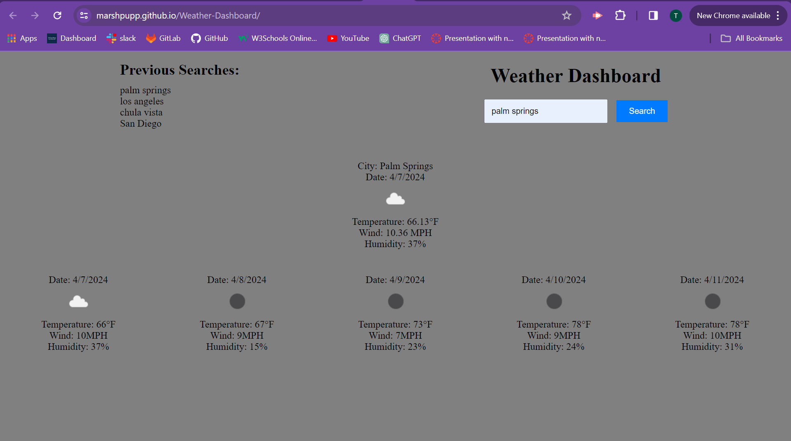

# Weather-Dashboard

## Description ##
An application that allows you to search for the current and future weather forecasts.

## User Story ##
~~~
AS A traveler
I WANT to see the weather outlook for multiple cities
SO THAT I can plan a trip accordingly
~~~
## Acceptance Criteria ##
~~~
GIVEN a weather dashboard with form inputs
WHEN I search for a city
THEN I am presented with current and future conditions for that city and that city is added to the search history
WHEN I view current weather conditions for that city
THEN I am presented with the city name, the date, an icon representation of weather conditions, the temperature, the humidity, and the the wind speed
WHEN I view future weather conditions for that city
THEN I am presented with a 5-day forecast that displays the date, an icon representation of weather conditions, the temperature, the wind speed, and the humidity
WHEN I click on a city in the search history
THEN I am again presented with current and future conditions for that city

~~~

## Links ##
Link to repository: https://github.com/MarshPupp/Weather-Dashboard

Link to deployed site: https://marshpupp.github.io/Weather-Dashboard/
## Deployed Images ##

## Acknowledgements ##
* MDN docs were referenced (https://developer.mozilla.org/en-US/)
* W3Schools were referenced (https://www.w3schools.com/css/default.asp)
* Chat GPT for Read Me format and starter code